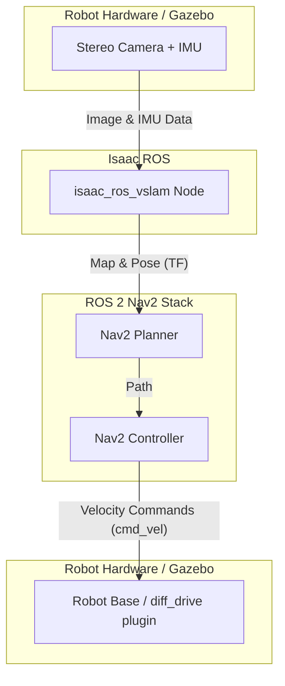

# Lesson 16.2: Isaac ROS VSLAM

**SLAM** (Simultaneous Localization and Mapping) is one of the most fundamental problems in mobile robotics. It is the process of building a map of an unknown environment while simultaneously keeping track of the robot's position within that map.

**VSLAM** (Visual SLAM) is a category of SLAM algorithms that use camera images as their primary sensor input.

The `isaac_ros_vslam` package is NVIDIA's GPU-accelerated solution for VSLAM. It is designed for high performance on NVIDIA's embedded Jetson platforms.

## How it Works

The `isaac_ros_vslam` node takes two main inputs:
1.  **Stereo Images:** A pair of synchronized images from a left and right camera. The slight difference in perspective between the two images allows the algorithm to calculate depth.
2.  **IMU Data:** Data from an Inertial Measurement Unit, which provides information about the robot's orientation and acceleration.

From these inputs, it produces two key outputs:
1.  **Pose (`/tf`):** The real-time estimated position and orientation of the robot. It publishes this as a transform from a fixed `odom` frame to the robot's `base_link` frame.
2.  **Map (`/map`):** A point cloud representing the 3D structure of the environment that the robot has observed so far.

## Integrating with Nav2

The output of `isaac_ros_vslam` is designed to be a drop-in input for the standard ROS 2 Navigation Stack, **Nav2**.

Nav2 is a highly configurable system that handles path planning and obstacle avoidance. It needs two things to function: a map of the world and the current pose of the robot within that map. Isaac ROS VSLAM provides both.

The data flow looks like this:

1.  The stereo camera and IMU (either real or simulated in Gazebo/Isaac Sim) publish their data.
2.  The `isaac_ros_vslam` node subscribes to this data.
3.  The VSLAM node processes the data on the GPU and publishes the robot's pose as a TF transform and the map as a point cloud.
4.  The Nav2 stack uses the map for long-range planning and the TF transform for localization.
5.  When given a goal, the Nav2 planner creates a path through the map.
6.  The Nav2 controller generates `Twist` messages to follow the path, publishing them on `/cmd_vel`.
7.  The robot's differential drive controller receives the `/cmd_vel` messages and moves the robot.

This tight integration between the GPU-accelerated perception of Isaac ROS and the high-level planning of Nav2 allows for the creation of robust, high-performance autonomous navigation systems on embedded hardware.
