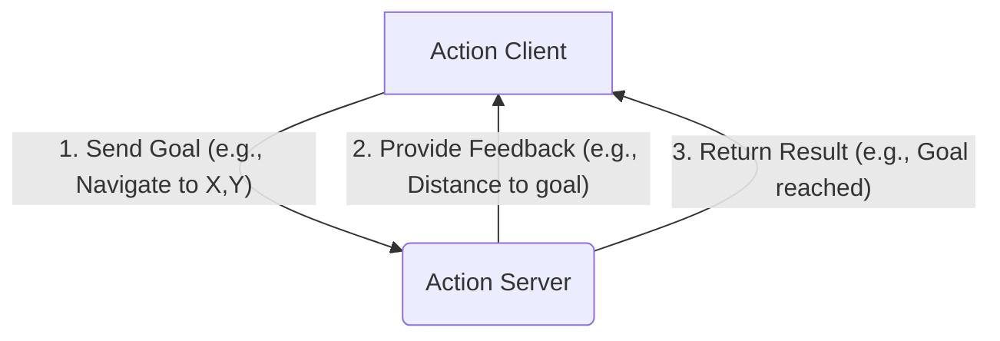

# Week 3: ROS 2 Architecture

Welcome to Week 3. Now that we have our hardware ready, it's time to dive into the software that will act as the nervous system for our robot: the Robot Operating System (ROS) 2.

## The Philosophy of ROS 2

ROS is not a traditional operating system. It's a flexible framework for writing robot software. It is a collection of tools, libraries, and conventions that aim to simplify the task of creating complex and robust robot behavior across a wide variety of robotic platforms.

The core philosophy of ROS is built on the idea of modularity and communication. Instead of a single, monolithic program, a ROS system is comprised of many small, independent programs called **nodes** that communicate with each other by passing **messages**.

## The ROS 2 Graph: A Network of Nodes

The entire ROS 2 system can be visualized as a graph. This graph is a network of ROS 2 nodes that are processing information together.

### ROS 2 Nodes

A **node** is the fundamental unit of computation in ROS 2. Think of a node as a small, single-purpose program. For example, you might have:
- A node for controlling the wheel motors.
- A node for reading data from a laser scanner.
- A node for planning a path.
- A node for a user interface.

Each node is a separate executable that can be written, compiled, and run individually.

## Communication Mechanisms

Nodes are not very useful in isolation. They need to communicate. ROS 2 provides three primary communication mechanisms:

1.  **Topics (Publish / Subscribe)**
2.  **Services (Request / Reply)**
3.  **Actions (Long-running Goals)**

### 1. Topics: The Bulletin Board

Topics are the most common way to communicate in ROS. They follow a **publish/subscribe** model.

-   A node **publishes** messages to a named topic.
-   Any number of other nodes can **subscribe** to that topic to receive the messages.

This is an anonymous, one-to-many communication method. The publisher doesn't know who is subscribing, and the subscribers don't know who is publishing. It's like posting a notice on a public bulletin board.

**Diagram: Publish/Subscribe Model**
```mermaid
graph TD
    A[Publisher Node<br/>(e.g., Camera Driver)] -- "Publishes Image Message" --> B(Topic: /image_raw);
    B -- "Delivers Image Message" --> C[Subscriber Node<br/>(e.g., Object Detection)];
    B -- "Delivers Image Message" --> D[Subscriber Node<br/>(e.g., Image Viewer)];
```

### 2. Services: The Phone Call

Services are used for **request/reply** communication. This is a two-way, synchronous communication.

-   A **client** node sends a request message to a **server** node.
-   The server node processes the request and sends back a response message.

This is a one-to-one communication, similar to making a phone call. The client waits (blocks) until the server provides a response.

**Diagram: Service Model**
```mermaid
graph LR
    A[Client Node<br/>(e.g., User Interface)] -- "Request: AddTwoInts" --> B(Service Server Node<br/>(e.g., Calculator));
    B -- "Response: Sum" --> A;
```

### 3. Actions: The Project Manager

Actions are used for long-running, asynchronous tasks that provide feedback. They are like services, but they don't block and can be cancelled.

An action has three parts:
-   **Goal:** The client sends a goal to the action server (e.g., "Rotate 90 degrees").
-   **Feedback:** The server provides regular feedback on the progress of the goal (e.g., "Rotated 45 degrees").
-   **Result:** The server sends a final result when the goal is complete (e.g., "Rotation complete").

This is perfect for tasks like navigation, where it might take a long time to reach a destination and you want to know how it's going along the way.

**Diagram: Action Model**


This modular, message-passing architecture makes ROS 2 extremely powerful and flexible, allowing us to build complex systems from simple, reusable components. In the next week, we will learn how to create these components ourselves.
