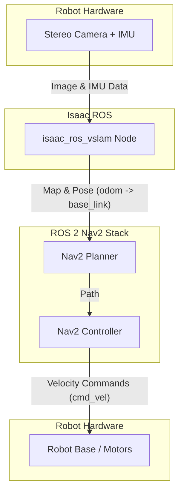

# Week 9: Isaac ROS and Navigation

Last week we introduced Isaac Sim. This week, we bridge the gap between the simulator and our robot's "brain" with **Isaac ROS**. These are a collection of hardware-accelerated ROS 2 packages for perception, navigation, and manipulation, optimized for NVIDIA's Jetson platform and GPUs.

## The Isaac ROS Ecosystem

The power of Isaac ROS lies in its use of **NVIDIA CUDA** and other libraries to dramatically speed up common robotics algorithms. Instead of running on the CPU, these intensive computations are offloaded to the GPU, freeing up the CPU for other tasks. This is essential for achieving real-time performance on resource-constrained edge devices like the Jetson Orin Nano.

Isaac ROS provides high-performance packages for:
- **Visual SLAM (VSLAM):** To track the robot's position and create a map of the environment simultaneously using camera data.
- **Object Detection:** To identify and locate objects in the scene.
- **AprilTags:** To detect special fiducial markers for precise localization.
- **DOPE (Deep Object Pose Estimation):** To estimate the 6D pose of known objects.

## Visual SLAM with Isaac ROS

Simultaneous Localization and Mapping (SLAM) is a fundamental problem in robotics. Isaac ROS provides a hardware-accelerated package for VSLAM that is both fast and accurate.

The `isaac_ros_vslam` package takes in stereo camera images and IMU data and produces two key outputs:
1.  **Robot Pose:** The estimated position and orientation of the robot in the world (`/tf` transform from `odom` to `base_link`).
2.  **Map:** A point cloud of the environment (`/map`).

Here’s a simplified look at how to launch the VSLAM node:

```python
from launch_ros.actions import ComposableNodeContainer
from launch_ros.descriptions import ComposableNode

def generate_launch_description():
    # VSLAM node
    vslam_node = ComposableNode(
        name='visual_slam_node',
        package='isaac_ros_vslam',
        plugin='isaac_ros::visual_slam::VisualSlamNode',
        remappings=[('stereo_camera/left/image', '/camera/left'),
                    ('stereo_camera/right/image', '/camera/right'),
                    ('stereo_camera/left/camera_info', '/camera_info/left'),
                    ('stereo_camera/right/camera_info', '/camera_info/right')]
    )

    container = ComposableNodeContainer(
        name='vslam_container',
        namespace='',
        package='rclcpp_components',
        executable='component_container',
        composable_node_descriptions=[vslam_node],
        output='screen'
    )

    return LaunchDescription([container])
```
This launch file starts a `ComposableNodeContainer` and loads the `VisualSlamNode` into it. We use `remappings` to connect the inputs of the VSLAM node to the topics where our camera is publishing images.

## Integrating with the Nav2 Stack

Knowing where you are is only half the battle. The robot also needs to be able to autonomously navigate from point A to point B while avoiding obstacles. This is the job of the **ROS 2 Navigation Stack (Nav2)**.

Nav2 is a powerful, highly-configurable navigation system. It takes in a map, the robot's pose, and a goal, and it outputs velocity commands to move the robot.

The integration of Isaac ROS VSLAM and Nav2 is the key to autonomous navigation:
1.  **Map Source:** The `isaac_ros_vslam` node provides the map of the environment that Nav2 needs for planning.
2.  **Pose Source:** The VSLAM node provides the continuous, real-time estimate of the robot's position, which Nav2 uses for localization within the map.

**The Data Flow:**



By connecting the hardware-accelerated perception from Isaac ROS to the high-level planning of Nav2, we can build a robust and performant navigation system for our robot. This combination allows the robot to map an unknown environment and then navigate through it autonomously, all while running efficiently on an embedded Jetson platform.
