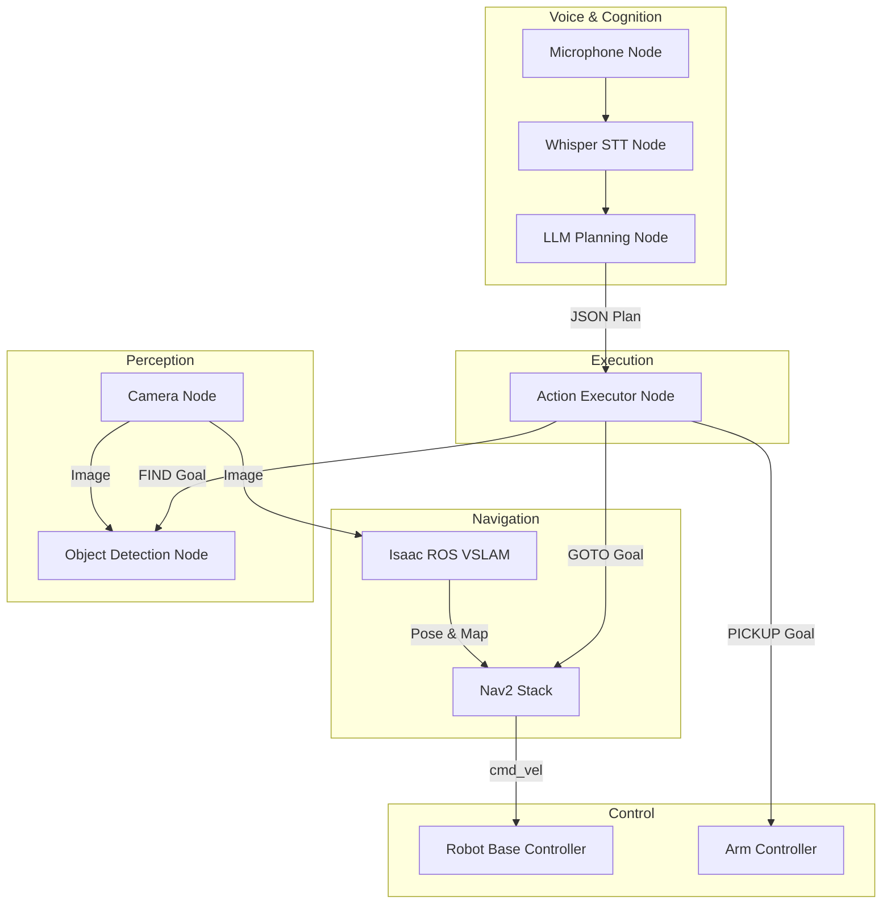

# Week 13: Capstone Project - The Autonomous Humanoid

Welcome to the final week and the culmination of this course. Over the past 12 weeks, we have explored the individual components of a modern robotics system, from low-level control to high-level AI. In this capstone project, your mission is to integrate these components into a single, cohesive system to create an autonomous, voice-commanded service humanoid.

## The Goal

The final project goal is to enable the robot to perform the following sequence:

1.  **Listen:** The robot must listen for a natural language voice command from a human user.
2.  **Understand:** It must process this command using a Large Language Model to determine the user's intent and generate a plan.
3.  **Navigate:** It must autonomously navigate to a specified location using its VSLAM and Nav2 stack.
4.  **Perceive:** It must use its perception system to locate the target object in the environment.
5.  **Act:** It must position itself correctly to prepare for a manipulation task (the manipulation itself is a stretch goal).

**Example Scenario:**
> **User:** "Hey robot, could you go to the kitchen and find me the water bottle?"
>
> **Robot's Actions:**
> 1. Transcribes the audio to text.
> 2. Sends the text to an LLM, which generates a plan: `[GOTO(kitchen), FIND(water_bottle)]`.
> 3. The robot executes the `GOTO` action, using Nav2 to plan a path to the kitchen, avoiding obstacles.
> 4. Upon reaching the kitchen, the robot executes the `FIND` action, using its camera and an object detection model to search for the water bottle.
> 5. The robot finds the water bottle and announces, "I have found the water bottle." It then moves its base and arm into a position ready to pick it up.

## System Architecture

You will need to bring together all the major systems we have studied in this course. Your final launch file should start a network of nodes that looks something like this:

## Project Requirements

To successfully complete the capstone, your system must:

1.  **Integrate the Voice-to-Action Pipeline:** Your robot must accept a voice command and generate a correct, multi-step JSON plan.
2.  **Utilize the Nav2 Stack:** Your robot must be able to navigate to at least two different pre-defined locations based on the plan generated by the LLM. The navigation must use the map and pose generated by your VSLAM node.
3.  **Demonstrate Perception:** Upon reaching the target location, the robot must use an object detection model to find a target object. You can use a pre-trained model for this.
4.  **Launch with a Single Command:** The entire system must be startable with a single `ros2 launch` command.
5.  **Simulation First:** The entire sequence must be demonstrable in a simulator (Isaac Sim or Gazebo). A physical robot demonstration is a bonus, not a requirement.

### Stretch Goals
- **Full Manipulation:** Implement the `PICKUP` action using MoveIt2 or another motion planning library to have the robot actually grasp the object.
- **Dynamic Obstacle Avoidance:** Demonstrate that the robot can navigate while avoiding moving obstacles.
- **Multi-command Memory:** Allow the robot to remember context from previous commands.

This capstone project is your opportunity to demonstrate your mastery of the principles of Physical AI. Good luck, and have fun building your autonomous humanoid!
